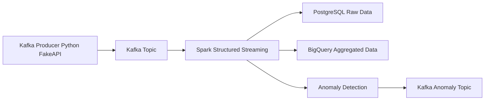

# 📊 Clickstream Analysis & Anomaly Detection with Kafka & Spark Streaming

A real-time **Clickstream Data Processing and Anomaly Detection Pipeline** built using **Apache Kafka, Apache Spark Structured Streaming, PostgreSQL, and Google BigQuery**. It ingests, processes, analyzes, and detects anomalies in web clickstream data, posting alerts back to Kafka for real-time monitoring.

## 🚀 Features
- **Kafka Producer(Python FakeAPI)** – Produces clickstream events in real-time.  
- **Spark Structured Streaming** – Consumes data from Kafka, processes it, and performs anomaly detection.  
- **PostgreSQL for Raw Data** – Stores raw clickstream events for further analysis.  
- **BigQuery for Aggregated Data** – Stores processed and aggregated data for analytical queries and dashboards.  
- **Anomaly Detection** – Detects unusual behavior and posts alerts back to a Kafka topic.

## 🛠️ Technologies Used
- **Apache Kafka** – Event streaming  
- **Apache Spark Structured Streaming** – Real-time processing & anomaly detection  
- **PostgreSQL** – Transactional storage  
- **Google BigQuery** – Analytical storage  
- **Python** – Synthetic clickstrem data 

## 📌 Use Cases
- ✅ Website visitor behavior analysis   
- ✅ User segmentation & engagement analysis  
- ✅ Real-time anomaly detection & alerting
- ✅ Fraudulent activity monitoring  

## ⚙️ Architecture

### Description:
1. **Kafka Producer (Python FakeAPI)**: The producer creates and sends messages to a Kafka topic.  
2. **Spark Structured Streaming**: Spark reads messages from the Kafka topic in real time.  
3. **PostgreSQL**: Spark writes raw data to PostgreSQL.  
4. **BigQuery**: Aggregated data from Spark is stored in BigQuery.  
5. **Anomaly Detection**: Spark processes the data for anomaly detection.  
6. **Kafka Anomaly Topic**: Anomalous data is posted to a Kafka topic for real-time monitoring.

## 🧑‍💻 Setup and Deployment
###  Deploy Kafka on GCP VM:
#### 1. Install Java (Required for Kafka & Spark)
```bash
sudo apt update
sudo apt install -y openjdk-11-jdk
java -version
````
#### 2. Install Apache Kafka
##### Download and Extract Kafka
```bash
wget https://downloads.apache.org/kafka/3.6.1/kafka_2.13-3.6.1.tgz
tar -xzf kafka_2.13-3.6.1.tgz
mv kafka_2.13-3.6.1 kafka
cd kafka
```
##### Start Zookeeper
```bash
bin/zookeeper-server-start.sh -daemon config/zookeeper.properties
```
##### Start Kafka broker
```bash
bin/kafka-server-start.sh -daemon config/server.properties
```
### Install Apache Spark
#### Download and Extract Spark
```bash
wget https://downloads.apache.org/spark/3.5.4/spark-3.5.4-bin-hadoop3.tgz
tar -xzf spark-3.5.4-bin-hadoop3.tgz
mv spark-3.5.4-bin-hadoop3 spark
```
#### Set Environment Variables
```bash
echo 'export SPARK_HOME=~/spark' >> ~/.bashrc
echo 'export PATH=$SPARK_HOME/bin:$SPARK_HOME/sbin:$PATH' >> ~/.bashrc
echo 'export PYSPARK_PYTHON=/usr/bin/python3' >> ~/.bashrc
source ~/.bashrc
```
### Install Jupyter Lab
```bash
pip install jupyterlab findspark
```
#### Configure Jupyter to Use PySpark
```bash
echo 'export PYSPARK_DRIVER_PYTHON=jupyter' >> ~/.bashrc
echo 'export PYSPARK_DRIVER_PYTHON_OPTS="lab --ip=0.0.0.0 --port=8888 --no-browser"' >> ~/.bashrc
source ~/.bashrc
```
#### Run Jupyter Lab
```bash
jupyter lab --ip=0.0.0.0 --port=8888 --no-browser
```

## 📜 Contributing
Contributions are welcome! Feel free to submit issues or open a PR.

## 📄 License
MIT License


    
